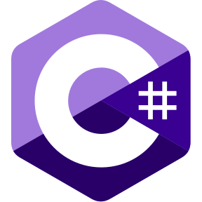
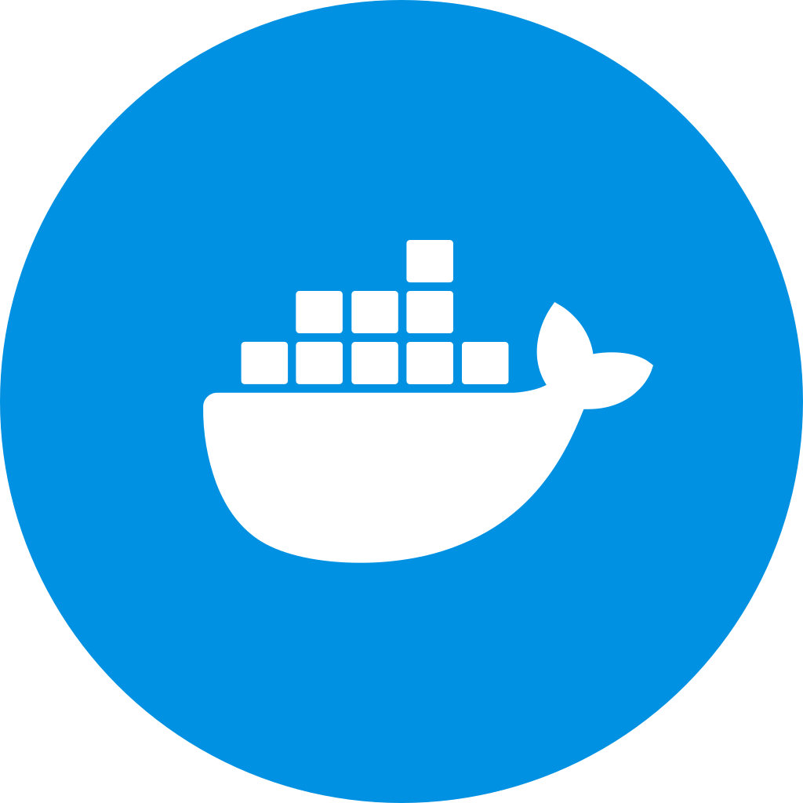

<section>
   <table>
      <tr>
         <td>
               
         </td>
         <td>
            <h1>Nhlanhla Malaza</h1>
         
Tech and Lifestyle | Helping startup E-Commerce businesses
         

         

            <table>
               <tr>
                  <td>
                     
                     Johannesburg, South Africa
                  </td>
                  <td>
                     
                     2 Years Experience   
                  </td>
                  <td>
                     
                     <a
                        href="https://www.rysis.co.za/"
                        target="_blank"
                        rel="noreferrer"
                        aria-label="Current employer"
                     >
                        Rysis Software
                     </a>   
                  </td>
               </tr>
            </table>
         

         </td>
      </tr>
   </table>
</section>

---

<section>
   <h4>Contact</h4>
   <table>
      <tr>
         <td>
            <a
               href="https://njmtech.vercel.app/"
               target="_blank"
               rel="noreferrer"
               aria-label="Portfolio Website"
            >
               
               Portfolio
            </a>
         </td>
         <td>
            <a
               href="https://twitter.com/nhlanhlamalaza_"
               target="_blank"
               rel="noreferrer"
               aria-label="Portfolio Website"
            >
               
               Twitter
            </a>
         </td>
         <td>
            <a
               href="https://www.linkedin.com/in/njmalaza/"
               target="_blank"
               rel="noreferrer"
               aria-label="Portfolio Website"
            >
               
               LinkedIn
            </a>
         </td>
               </tr>
   </table>
</section>

---

<section>
   <h4>About</h4>
   

      A passionate software developer, willing to learn and adapt to any software environment. I am always striving to improve myself and my skills. I enjoy working with others and within a team.
   

</section>

---

<section>
   <h4>Tech Stack</h4>
   <table>
      <tr>
         <td>
            
            C#
         </td>
         <td>
            
            React
         </td>
         <td>
            
            SQL
         </td>
      </tr>
      <tr>
         <td>
            
            Docker
         </td>
         <td>
            
            GitHub
         </td>
         <td>
            
            TypeScript
         </td>
      </tr>
      <tr>
         <td>
            
            Postman
         </td>
         <td>
            
            VS Code
         </td>
         <td>
            
            Node JS
         </td>
      </tr>
   </table>
</section>

---

<section>
   <h4>Repository Stats</h4>
   <table>
      <tr>
         <td>
            

               
            

         </td>
         <td>
            

               
            
     
         </td>
      </tr>
      <tr>
      <td>
         

            
         

      </td>
      </tr>
   </table>

</section>
